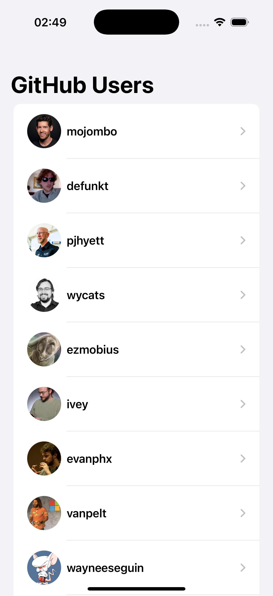
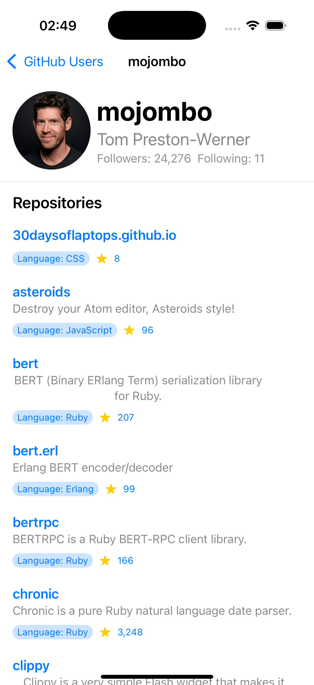

# GitHub Client App Sample

This is a sample iOS client application built with **SwiftUI** for Browse GitHub user information and their public repositories. Designed with **team development** and a focus on **user experience (UX)** in mind, it demonstrates a clean **MVVM architecture** with a dedicated network service layer.

-----

## Architecture

This project adopts the **MVVM (Model-View-ViewModel)** architectural pattern to ensure clear separation of concerns, making the codebase maintainable and testable, which is crucial for team development.

### Models

**Models** define the fundamental data structures used throughout the application. These structures directly map to the JSON responses received from the GitHub API, ensuring data consistency.

### Services

The **Services** layer, specifically `GitHubService`, is solely responsible for handling all network communication with the GitHub API. It encapsulates API request logic, error handling, and data decoding, keeping the rest of the application free from networking concerns.

### ViewModels

**ViewModels** act as the crucial bridge between the Views and Models. They contain the business logic, transform data for display, and manage the state of the UI. Views observe changes in their respective ViewModels, ensuring a reactive user interface.

### Views

**Views** are responsible for presenting the entire user interface. They are designed to be lightweight and declarative, observing data exposed by the ViewModels and reacting to user interactions.

-----

## Project Organization

The project's file structure is organized logically to reflect the architectural layers, promoting easy navigation and scalability.

```
GitHubClientApp/GitHubClientApp
├── Assets.xcassets
│   ├── AccentColor.colorset
│   ├── AppIcon.appiconset
│   └── Contents.json
├── ContentView.swift
├── GitHubClientAppApp.swift
├── Models
│   ├── APIError.swift
│   ├── Repository.swift
│   └── User.swift
├── Services
│   └── GitHubService.swift
├── Utilities
│   └── Secrets.swift # Placeholder for sensitive information like API tokens
├── ViewModels
│   ├── UserDetailViewModel.swift
│   └── UserListViewModel.swift
└── Views
    ├── RepositoryRowView.swift
    ├── UserDetailView.swift
    ├── UserListView.swift
    ├── UserRowView.swift
    └── WebView.swift
```

-----

## Getting Started

To run this application, you'll need a **GitHub Personal Access Token**. This token helps avoid hitting the lower API rate limits (60 requests per hour without authentication).

1.  **Generate a Personal Access Token:**

      * Go to your GitHub settings: `Settings > Developer settings > Personal access tokens`.
      * Click "Generate new token".
      * Give it a descriptive name (e.g., `GitHubClientAppSampleToken`).
      * No specific scopes are needed for read-only access to public user and repository data.
      * Copy the generated token immediately; you won't be able to see it again.

2.  **Configure the Token in the App:**

      * Open `GitHubClientApp.xcodeproj` in Xcode.
      * Navigate to `Utilities/Secrets.swift`.
      * Locate the `githubToken` property and replace `"YOUR_GITHUB_PERSONAL_ACCESS_TOKEN"` with your copied token.

    ```swift
    // Secrets.swift
    enum Secrets {
        static let githubToken = "YOUR_GITHUB_PERSONAL_ACCESS_TOKEN"
    }
    ```

      * **Important:** For real-world applications, storing your token directly in the source code is **not recommended**. Consider using environment variables, Xcode build settings, or a dedicated secrets management utility.

3.  **Run the Application:**

      * Select your desired simulator or device.
      * Build and run the project (`Cmd + R`).

-----

## Screenshots

### User List


### User Details

